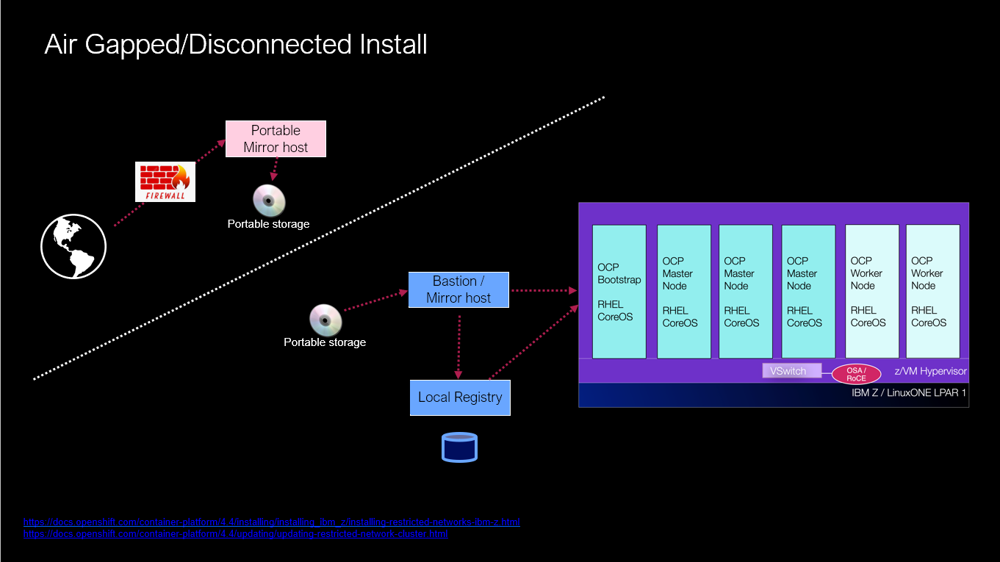

# openshift-airgap-install
Some helper scripts to facilitate airgap installation and/or update of an Openshift 4.x cluster.

Openshift V4.x supports installation of a cluster, where the nodes of the cluster have NO Internet connectivity.  
This is also sometimes referred to as an "airgap" install.  
Referring to the following graphic...   
  

Notice that the pods in the Openshift cluster pull their images from a local image registry.  
In order to populate this local registry with the Redhat-provided Openshift container images, you must first mirror the Openshift images onto some form of portable storage.  And then move that portable storage into the target environment, whereupon the images are subsequently copied into the internal local registry.

The shell scripts here are a simple means of implementing the procedures described in the Openshift V4.x Documentation for [Creating a mirror registry for installation in a restricted network](https://docs.openshift.com/container-platform/4.12/installing/disconnected_install/index.html)
